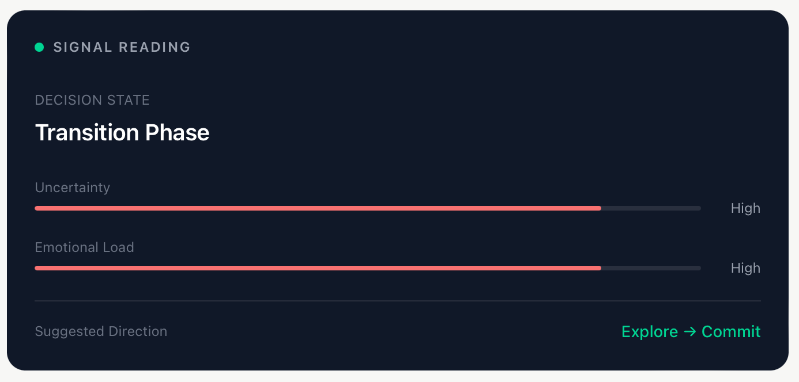
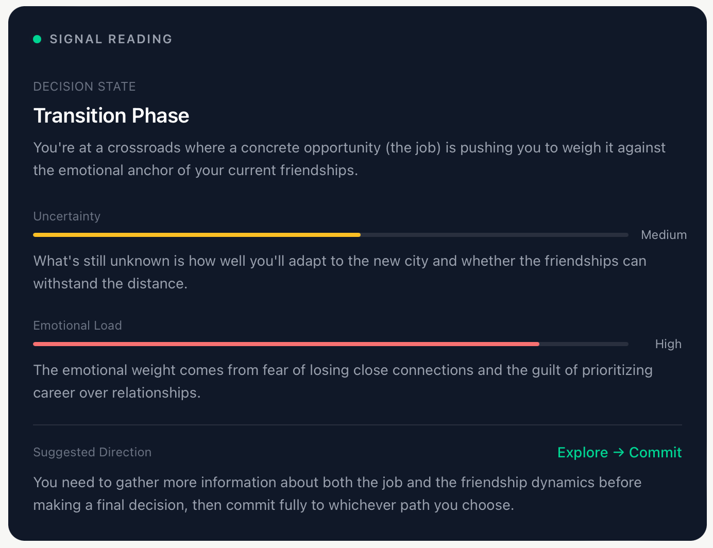

# Life Signals

> AI-assisted human decision reflection system

**Live Demo → [life-signals.vercel.app](https://life-signals.vercel.app)**


https://github.com/user-attachments/assets/227ac10b-33bd-47a0-a5d6-7c29d36448a4


---

## Overview

Life Signals is a web-based decision reflection tool that combines structured AI analysis with cognitive science principles. Rather than giving users a direct answer, the system helps users think more clearly about their own decisions by surfacing hidden assumptions, emotional biases, and unexplored scenarios.

The project explores how AI can support human reasoning without replacing it — a core question in human-AI interaction design.

---

## Key Features

**Signal Reading**
An assessment of the user's decision state — how far along they are, how much is still unknown, and how much emotional weight the decision carries. Each indicator is paired with a plain-language sentence explaining what it means for that specific decision (see *What Testing Changed* below).

**Scenario Engine**
Generates three structured paths (Safe / Risky / Balanced) for any decision, each with projected outcomes, key risks, and emotional experience — helping users compare futures rather than just options.

**Cognitive Bias Detection**
Identifies cognitive biases influencing the user's thinking (e.g. sunk cost fallacy, availability heuristic, optimism bias), with actionable strategies to overcome each one. Interactive — click to expand each bias.

**Structured Analysis**
Pros, cons, and key risks presented as structured cards rather than free-form text, making the analysis scannable and comparable.

**Reflection Questions**
Three deep questions generated to help users think beyond their initial framing of the problem.

---

## System Design

The AI is prompted to return strict JSON rather than free text, ensuring consistent structured output across all modules. The API key is held server-side in a Next.js route handler and is never exposed to the browser. Response language automatically matches the user's input language.

---

## Tech Stack

| Layer | Technology |
|-------|-----------|
| Frontend | Next.js 16, React, Tailwind CSS |
| AI | DeepSeek API (deepseek-chat) |
| Deployment | Vercel |
| Language | JavaScript |

---

## Design Decisions

**Why structured JSON output?**
Free-text AI responses look like a chatbot. Structured JSON allows the system to render each analysis dimension as a distinct UI component, making the output feel like a decision tool rather than a conversation.

**Why cognitive bias detection?**
Most decision tools focus on logical analysis. Humans make decisions emotionally first and rationalize later. Surfacing cognitive biases addresses the actual failure mode in human decision-making.

**Why three scenarios instead of one recommendation?**
A single AI recommendation creates dependency. Three scenarios force the user to engage with tradeoffs and make their own choice — preserving human agency in the decision process.

---

## What Testing Changed

Ten early users tried the tool. The clearest finding was one I did not expect.

**Signal Reading** — the module I had deliberately written in decision-science vocabulary — was the part people understood least. The concrete suggestions and reflection questions at the end were the parts they found most useful.

The vocabulary meant to signal rigour was doing the opposite. Users were handed a label — *"Transition Phase"*, *"Uncertainty: High"* — with nothing telling them what it meant for **their** situation. A classification is not an insight.

Each indicator is now paired with a one-sentence plain-language explanation grounded in the user's own input. The label still sets the frame; the sentence makes it usable.

| Before | After |
|--------|-------|
|  |  |

*Same input, before and after the change.*

---

## Running Locally

```bash
git clone https://github.com/Steph216/life-signals.git
cd life-signals
npm install
```

Create a `.env.local` file:

```
DEEPSEEK_API_KEY=your_api_key_here
```

```bash
npm run dev
```

Open http://localhost:3000

---

## Background

Built as a portfolio project exploring the intersection of AI and human decision-making. Developed from scratch over one week with no prior web development experience, as part of graduate school application preparation in Human-Computer Interaction and AI.

---

*Life Signals v0.6 · Built with Next.js and DeepSeek API*
